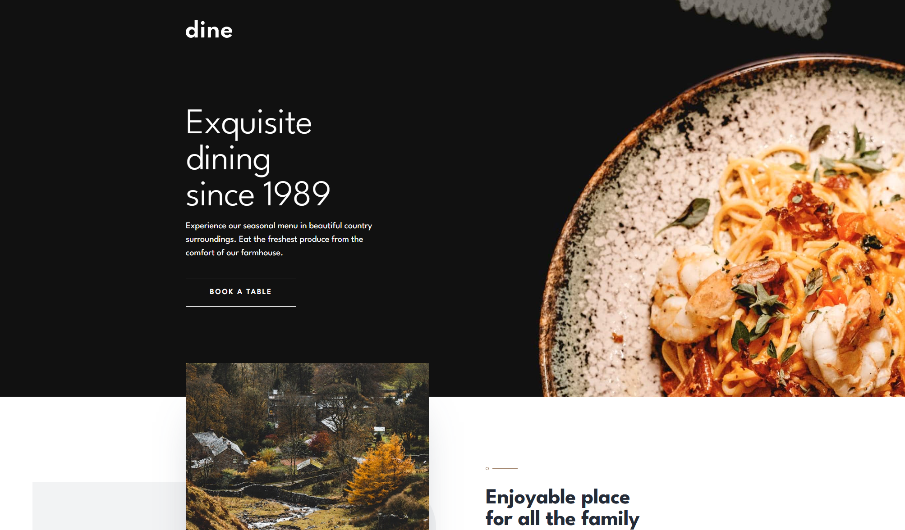

# Frontend Mentor - Dine Website Challenge solution

This is a solution to the [Dine Website Challenge challenge on Frontend Mentor](https://www.frontendmentor.io/challenges/dine-restaurant-website-yAt7Vvxt7). Frontend Mentor challenges help you improve your coding skills by building realistic projects.

## Table of contents

- [Overview](#overview)
  - [The challenge](#the-challenge)
  - [Screenshot](#screenshot)
  - [Links](#links)
- [My process](#my-process)
  - [Built with](#built-with)
  - [What I learned](#what-i-learned)
  - [Continued development](#continued-development)
  - [Useful resources](#useful-resources)
- [Author](#author)

## Overview

### The challenge

Users should be able to:

- View the optimal layout for each page depending on their device's screen size
- See hover states for all interactive elements throughout the site
- See the correct content for the Family Gatherings, Special Events, and Social Events section when the user clicks each tab
- Receive an error message when the booking form is submitted if:
  - The `Name` or `Email Address` fields are empty should show "This field is required"
  - The `Email Address` is not formatted correctly should show "Please use a valid email address"
  - Any of the `Pick a date` or `Pick a time` fields are empty should show "This field is incomplete"

### Screenshot



### Links

- Solution URL: [Frontend Mentor Dine Restaurant](https://www.frontendmentor.io/solutions/responsive-dine-restaurant-website-with-javascript-dEhKb-UtMC)
- Live Site URL: [Dine Restaurant](https://jezzydev.github.io/dine-restaurant-website/)

## My process

### Built with

- Semantic HTML5 markup
- CSS custom properties
- Flexbox
- CSS Grid
- Mobile-first workflow
- JavaScript

### What I learned

- If I want to set an element's height at 100%, all the parent elements up the hierarchy should have their height explicitly set.
- One way to images responsive is to use the <picture> element. This is especially useful when the goal is art direction i.e. When I need to make changes to the content or aspect ratio of an image. Within the <picture> element, I can add multiple <source> elements that the browser can choose from. The  element must still be included within the <picture> element, and any styling that needs to be done on the image must be targeted on the  element and not the <source> elements.

```html
<picture>
  <source
    media="(width <= 375px)"
    srcset="./images/homepage/enjoyable-place-mobile.jpg"
  />
  <source
    media="(width < 500px)"
    srcset="./images/homepage/enjoyable-place-mobile@2x.jpg"
  />
  <!-- Other sources... -->
  
</picture>
```

- It is not possible to add a ::before and ::after pseudo-element to an  element because it is a replaced element and does not contain content in the same way as other regular elements (e.g. div). Pseudo-elements ::before and ::after work by inserting content before or after existing content within an element. To get around this, wrap the  within a container element and generate a ::before and ::after content on that container element.

- A robust and flexible way to make visual overlaps is to use negative margin on the overlapping element while keeping it in the normal document flow. This avoids layout issues and makes overlaps responsive.

```css
.FeaturesContainer--overlapTop {
  margin-top: calc(-1 * var(--featuresOverlapWidth));
}

.FeaturesContainer--overlapBottom {
  margin-bottom: calc(-1 * var(--featuresOverlapWidth));
}
```

- In JavaScript, to check whether the whole string fully matches the regular expression pattern, add the ^ and $ anchors to the beginning and end of the regular expression respectively.

```js
const monthRegEx = /^(0?[1-9]|1[0-2])$/;
const dayRegEx = /^(0?[1-9]|[12][0-9]|3[01])$/;
const yearRegEx = /^\d{4}$/;
```

- To bypass the built-in HTML5 form validation rules, add the novalidate attribute to the <form> element. This is especially useful when using custom validation.
- After running a custom validation on a form control, it can be marked as invalid using the attribute `aria-invalid="true"`. And then use `[aria-invalid="true"]` as selector for styling.
- In JavaScript regular expression, the "." character behaves like a wildcard and matches any character except the newline (unless s flag is used). But if the "." is placed inside squale brackets `[]`, it loses this special meaning and just means a literal dot character.
- There is no way to disable JavaScript's autocorrection for Date. To check if an autocorrection has occurred, manually check this by comparing each part of the date to the original values.

```js
const y = 2024;
const m = 2;
const d = 35;

const test = new Date(y, m, d);

if (
  test.getFullYear() === y &&
  test.getFullMonth() === m &&
  test.getDate() === d
) {
  console.log("Same!");
}
```

### Continued development

I want to continue working on challenges / mini projects that involve:

- forms, form controls and validations
- manipulating the DOM
- complex layouts

### Useful resources

- [JavaScript Info](https://javascript.info/) - Great resource for quickly reviewing and understanding JavaScript.
- [MDN](https://developer.mozilla.org/en-US/docs/Web) - Quick search and glossary for anything related to HTML, CSS, JavaScript.

## Author

- Website - [jezzydev](https://github.com/jezzydev)
- Frontend Mentor - [@jezzydev](https://www.frontendmentor.io/profile/jezzydev)
